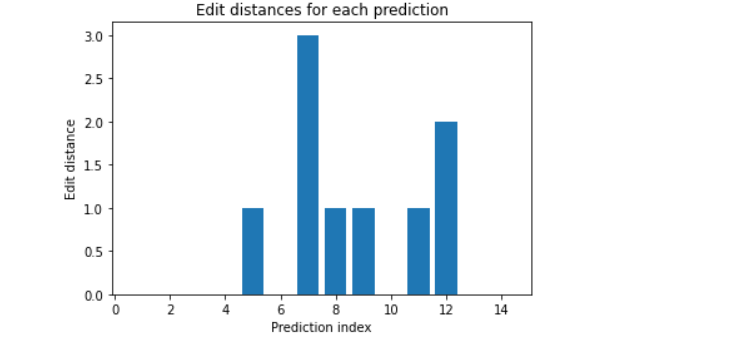

# Optical-Character-Recognition

This Machine learning package deals with:
     
    
     Yolo model for object detection
     Cascade classifier for license plate localization 
     Tesseract for Optical Character Recognition 

## Introduction
#
The objective of the package is to use optical character recognition in order to read vehicle license plates and convert them to text.

## YOLO Algorithm
#
The YOLO Algorithm API provided by the ImageAI library is used in order to detect whether a given image contains an object of interest or not. The detectObjectsFromImage function accepts three parameters - an input image, a path for an output image, and a minimum percentage probability. The YOLO algorithm is applied on the input image, and all predictions with confidence greater than the minimum percentage probability and returned, and the image with bounding boxes is written to the provided output path.

## Locating License Plates
#
In order to locate the license plate in the image, an approach based on the Viola Jones algorithm is used. The Viola - Jones algorithm is commonly used for facial recognition.

OpenCV provides the detectMultiScale function in the CascadeClassifier class in order to use a trained classifier. An XML file with the cascade of classifiers needs to be passed to the constructor of the class. In order to perform the detection, an addition parameter minNeighbours is required, which is a parameter specifying how many neighbors each candidate rectangle should have to retain it. A low value of minNeighbours results in more false positives, and a high value of minNeighbours results in lesser false positives but a greater chance of a true positive being missed.

## Tesseract-OCR
#
Tesseract OCR is an open source optical character recognition tool maintained by Google. The license plate images are provided to Tesseract in order to recognize the characters. pytesseract is a wrapper for Google's Tesseract engine pytesseract provides three main functions for character recognition:

image_to_string - Returns unmodified output as string from Tesseract OCR processing

image_to_boxes - Returns result containing recognized characters and their box boundaries

image_to_data- Returns result containing box boundaries, confidences, and other information.

## Before filtering Car images
#

## After Filtering Car images
#

## Filtered images with bounding boxes
#

## Filtered images with bounding boxes
#

## Performance Measures
#

After pytesseract processing that result is taken as dictionary value with file name as the number plate pattern manually typed comparsion is made with edit_distance

### Done by:
#
    Saketh Raman KS (19PW26)
    Sanjay T (19PW28)

